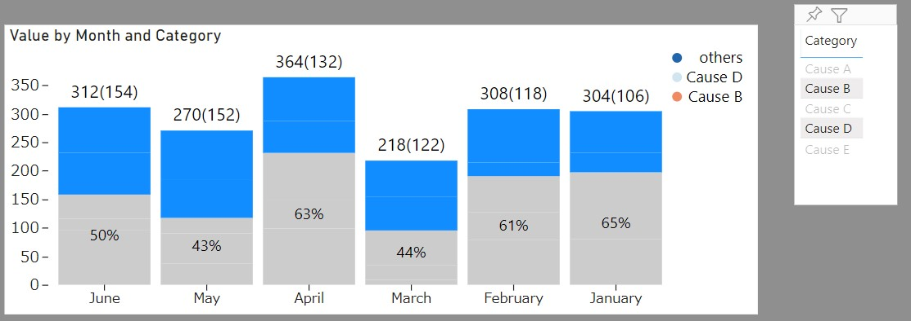

# Power BI Custom Chart Sample

A Bin Stacked Column Chart makes it easier to see selected items and non-selected items ratio by makes same color for each items.

For example, I select "Cause B" and "Cause D" in the following chart. By using this chat, you can see the ratio of "Selected causes" vs "Other causes".



# How to use it

You can download source code and package it by using pbiviz

```shell
pbiviz package
```

Or you can simply download pbiviz file from release.

# License
[MIT License](LICENSE)